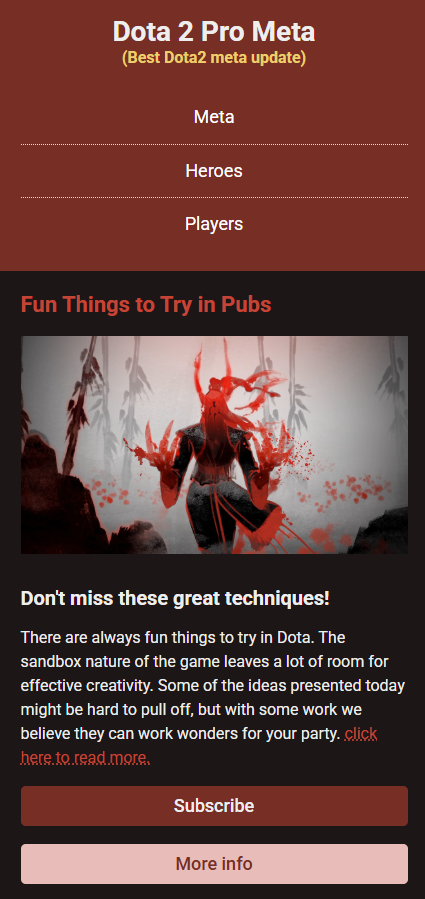

# Dota 2 Pro Meta - Responsive Website

A responsive website focused on Dota 2 professional meta strategies, built as a practice project for responsive web design techniques.

## Demo
[Live Demo](https://euphonious-sunburst-288cd7.netlify.app)



## About

This project was created as part of The Frontend Developer Career Path at Scrimba. It demonstrates responsive design principles with a theme centered around Dota 2 professional meta strategies and hero builds.

## Features

- Fully responsive layout that adapts to different screen sizes
- Mobile-first design approach
- Responsive navigation menu
- Image optimization for different viewport sizes
- Custom color scheme and typography

## Technologies

- HTML5
- CSS3
- Media Queries
- Flexbox
- Google Fonts (Roboto)

## Responsive Design Elements

The site includes several responsive design elements:

- Navigation transforms from vertical (mobile) to horizontal (desktop)
- Single column layout on mobile expands to multi-column on larger screens
- Image sizing adjusts based on viewport
- Typography scales appropriately across different device sizes
- Buttons adjust from stacked to inline depending on screen width
- Border styling changes between mobile and desktop versions

## Breakpoints

- Mobile: Up to 767px
- Desktop: 768px and above

## Project Structure

```
dota2-prometa/
├── images/
│   ├── pub.jpg
│   ├── wraith-king.png
│   └── invoker.webp
├── index.html
├── index.css
└── README.md
```

## Running the project

Clone the repository and open `index.html` in your browser:

```bash
git clone https://github.com/phattp/dota2-responsive-site.git
cd dota2-responsive-site
```

## What I learned

- Implementing responsive design using media queries
- Creating flexible layouts with Flexbox
- Building mobile-first designs that scale to larger screens
- Optimizing typography for readability across devices
- Managing spacing and proportions in responsive contexts
- Creating adaptive navigation systems

---

Created by [Phatthara Pisootrapee](https://github.com/phattp) | [The Frontend Developer Career Path at Scrimba](https://scrimba.com/learn/frontend)
